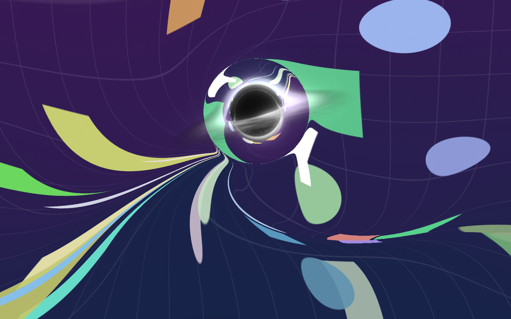
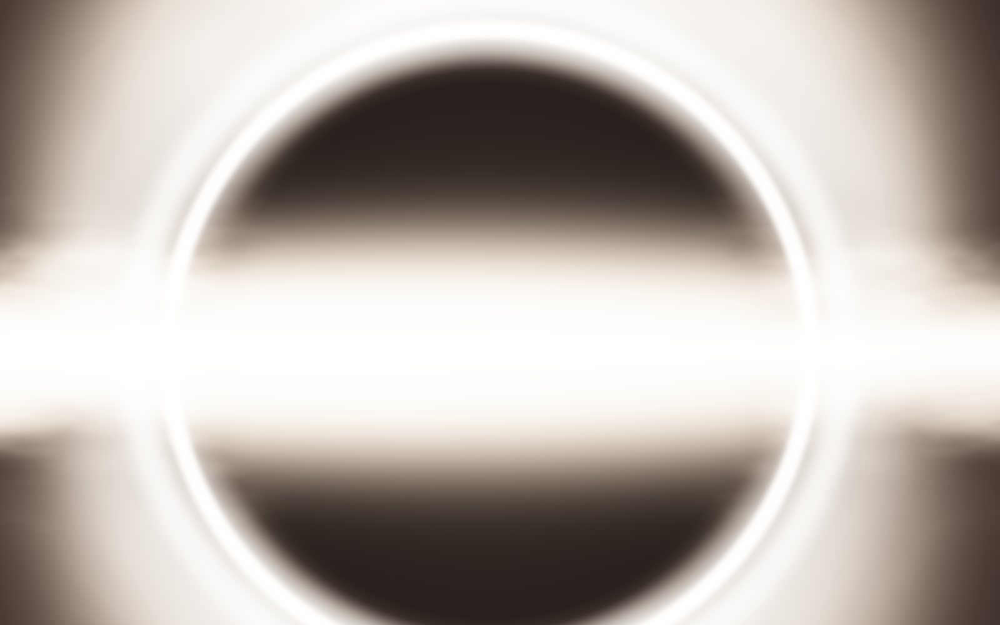

# Singularity 🕳️

A tiny Mac app that drops a black hole onto your screen and lets it eat everything.

Press one button and a small, glowing black hole appears over your desktop. It drifts around, bending and stretching whatever is on screen, slowly swallowing your windows, icons and wallpaper. And the screen stays *alive* while it happens — a playing video keeps playing right up until the moment it stretches, smears and disappears into the hole. The hole grows as it feeds, flares up into a huge ring of light, and in the end the whole screen is black. Press **Reset** and your desktop is back, completely unharmed.

| Feeding time | Growing up |
| --- | --- |
|  |  |

## How to use it

1. Open **Singularity.app** — a small control panel appears.
2. Set the **Appetite** slider: from *gentle nibble* (a slow three-minute meal) to *ravenous* (everything gone in seconds). You can move it while the black hole is feeding.
3. Click **Unleash** and watch your screen get devoured.
4. Keep working if you like — the show is click-through, so your mouse and keyboard still reach the real apps underneath while they're being eaten. A small circle of reality follows your pointer, showing the true live screen through the distortion so what you're aiming at is always what you'll click.
5. Click **Reset** (or press **Esc**) any time to get your screen back instantly. (If you've clicked into another app, Esc goes to that app instead — the floating Reset button always works.)

## Is my stuff safe?

Yes. The app watches a live *video feed* of your screen (the same mechanism screen-sharing apps use) and feeds that video to the black hole. Your real windows, files and apps sit untouched underneath the whole time. Reset simply removes the show.

## First launch

The app needs macOS's **Screen Recording** permission to see your screen. The first time you click Unleash, macOS will ask — allow it in **System Settings → Privacy & Security → Screen Recording**, then relaunch the app once.

## Building it yourself

You need a Mac with Apple Silicon and the Xcode command line tools. Then:

```bash
./build-app.sh
```

That produces `Singularity.app` in this folder. No Xcode project needed.

**One gotcha if you rebuild often:** macOS ties the Screen Recording permission to the app's code signature. The build script signs with a throwaway ("ad-hoc") signature by default, which changes on every build — so after each rebuild, macOS thinks it's a brand-new app and asks for permission again. To make the permission stick, create a self-signed code-signing certificate once (Keychain Access → Certificate Assistant → Create a Certificate → type *Code Signing*), put its name in the `IDENTITY` variable in `build-app.sh`, and every rebuild will be recognized as the same app.

## How it works (the slightly nerdy version)

- The screen is captured live at 60 fps with Apple's ScreenCaptureKit, with the app's own windows excluded from the capture — otherwise the overlay would film itself and recurse into an infinite mirror.
- The eating is a small GPU simulation written in Metal. It doesn't warp the video frames directly — it warps a *flow field*: a map that records, for every point on screen, where that point should fetch its picture from. Every frame each map entry is pulled a tiny step closer to the hole and rotated around it, so screen content genuinely *flows* into the hole — while regions that haven't been eaten yet keep showing live, moving video. Darkness creeps in from the edges of the screen as the flow lines run out of desktop.
- The black hole itself is a Metal port of Vercel's [vgpu "optimized black hole"](https://vgpu.sh/examples/optimized-black-hole): light rays are traced through Schwarzschild spacetime once into a G-buffer (where each ray crosses the accretion disk, and where it ends up in the sky), boundary pixels are refined with 16 sub-rays for antialiasing, and every frame the disk is shaded from a 3D noise volume with Doppler beaming and gravitational redshift, bloomed through a three-level pyramid and tone-mapped — the monochrome *Interstellar* look. Because that bake is just a zoom-and-pan of the image plane, the app re-uses it as the hole moves and grows, re-baking continuously in slices so it never hitches.
- Your desktop is the black hole's sky: the traced ray directions are mapped back onto the screen, so what you see around the hole is your real windows, gravitationally lensed into an Einstein ring. Where the desktop has already been eaten, a lensed star field shows through instead.
- There's a hidden test mode for hacking on the effect without any permissions: `Singularity.app/Contents/MacOS/Singularity --test --out=/some/folder` runs the whole simulation against a built-in synthetic image and writes checkpoint PNGs (that's how the pictures above were made). Add `--anim` to dump ~20 back-to-back frames mid-meal for checking the disk animation, `--size=WxH` to render at another resolution, and `--profile` to list slow GPU frames.

Made for fun on a rainy Sunday. Feed responsibly.
